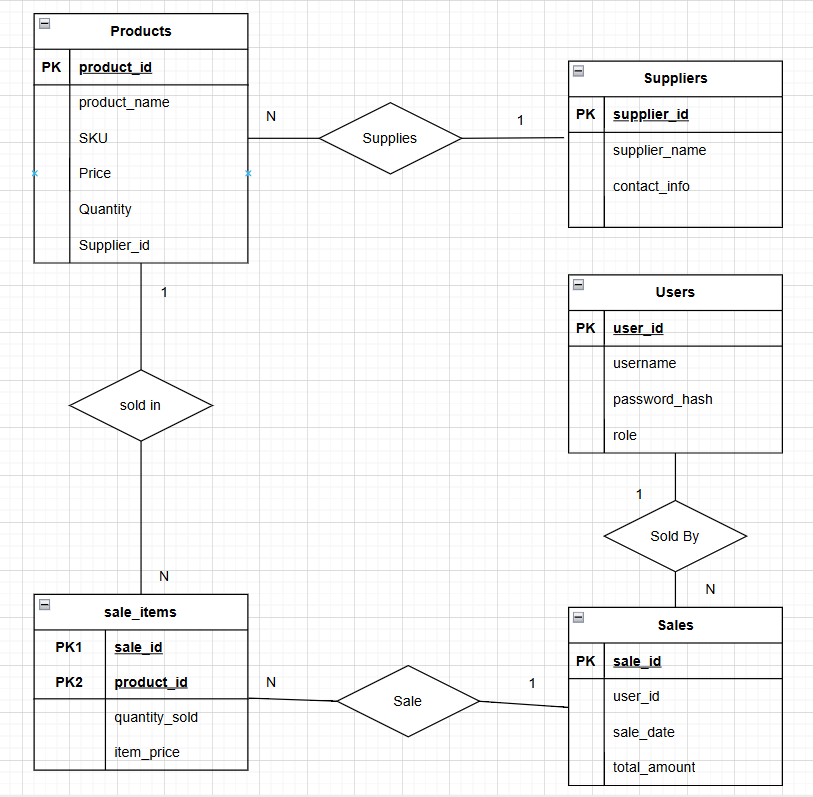
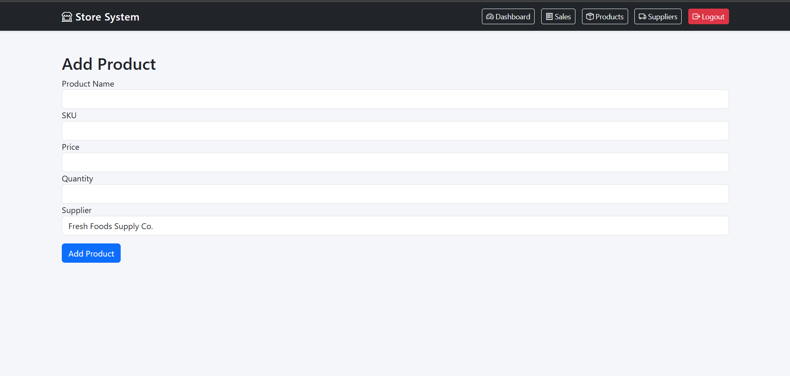
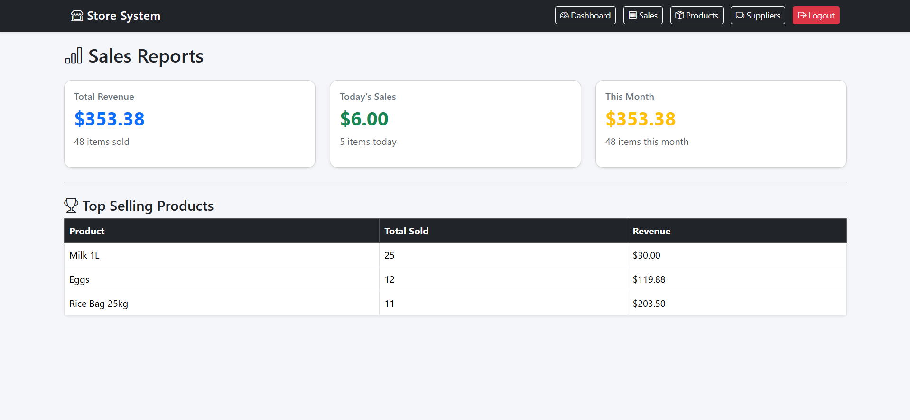

# 📘 Store Management System — Final Project (CIS 5210)

A Flask + MySQL web application demonstrating CRUD operations, modular architecture, JOIN-based reporting, authentication, and secure form validation.

---

## 1. Project Overview

### **Purpose**

This project implements a store management system allowing a manager and cashier to:

- Manage products & suppliers
- Process sales transactions
- Track stock levels in real-time
- View analytic sales reports

It demonstrates database-driven application design using Python Flask and MySQL.

### **Main Features**

- Product Management (CRUD)
- Supplier Management (CRUD)
- Sales creation with add/remove item operations
- Stock deductions and quantity tracking
- Auto-updated sale total calculation
- Dashboard with low-stock alerts
- JOIN-based reporting page using SQL views
- Authentication with password hashing
- Role-based access control (Manager vs Cashier)
- Modular architecture (Services + Repositories)

### **User Roles**

#### 👤 **Manager**

- Full system permissions
- Can manage products
- Can manage suppliers
- Can view analytics dashboard
- Can create and manage sales

#### 👤 **Cashier**

- Limited role
- Can create new sales
- Can add/edit items inside a sale
- Cannot edit products or suppliers
- Cannot see manager analytics

---

## 2. ERD (Entity Relationship Diagram)



### **ERD Explanation**

The system contains **five main entities**:

#### **1. Users**

- `user_id` (PK)
- username, password_hash, role
- One-to-many with Sales
- Used for authentication / authorization

#### **2. Suppliers**

- `supplier_id` (PK)
- supplier_name, contact_info
- One-to-many with Products

#### **3. Products**

- `product_id` (PK)
- SKU, price, stock quantity
- Many-to-one: belongs to Supplier
- One-to-many with Sale_Items

#### **4. Sales**

- `sale_id` (PK)
- sale_date, total_amount
- References Users (cashier/manager)
- One-to-many with Sale_Items

#### **5. Sale_Items**

- `sale_id` (FK → Sales)
- `product_id` (FK → Products)
- quantity_sold, item_price
- Represents a many-to-many relationship between Sales and Products

### **Cardinalities**

- Supplier → Products: **1 : Many**
- Product → Sale_Items: **1 : Many**
- Sales → Sale_Items: **1 : Many**
- Users → Sales: **1 : Many**
- Products ↔ Sales: **Many : Many** (resolved by Sale_Items)

---

## 3. DDL Discussion (schema.sql)

The file `schema.sql` (placed at project root) handles:

### ✔ **Database creation**

```
CREATE DATABASE IF NOT EXISTS store_db;
```

### ✔ **Primary Keys**

Each table uses an auto-increment numeric PK:

- `user_id`, `supplier_id`, `product_id`, `sale_id`

### ✔ **Foreign Keys and Cascades**

Example (Products → Suppliers):

```sql
FOREIGN KEY (supplier_id) REFERENCES suppliers(supplier_id)
    ON UPDATE CASCADE
    ON DELETE SET NULL;
```

Example (Sale_Items → Sales):

```sql
FOREIGN KEY (sale_id) REFERENCES sales(sale_id)
    ON DELETE CASCADE;
```

This ensures:

- Deleting a sale deletes its sale_items
- Deleting a supplier does NOT delete products

### ✔ **View Definition: sales_report**

Used for analytics:

```sql
CREATE VIEW sales_report AS
SELECT ...
FROM sales
JOIN sale_items ...
JOIN products ...
JOIN users ...
```

### ✔ **Initialization**

`initialize_database()` in `db.py` automatically:

- Creates DB
- Checks if tables exist
- Executes `schema.sql` if not initialized

---

## 4. CRUD Guide (All Entities)

### **Products**

| Operation | Route                   | DB Tables              |
| --------- | ----------------------- | ---------------------- |
| Create    | `/products/add`         | INSERT INTO products   |
| Read      | `/products`             | SELECT + SUPPLIER JOIN |
| Update    | `/products/edit/<id>`   | UPDATE products        |
| Delete    | `/products/delete/<id>` | DELETE products        |

---

### **Suppliers**

| Operation | Route                    | DB Tables |
| --------- | ------------------------ | --------- |
| Create    | `/suppliers/add`         | suppliers |
| Read      | `/suppliers`             | suppliers |
| Update    | `/suppliers/edit/<id>`   | suppliers |
| Delete    | `/suppliers/delete/<id>` | suppliers |

---

### **Sales**

| Operation    | Route                      | DB Tables                    |
| ------------ | -------------------------- | ---------------------------- |
| Create Sale  | `/sales/new`               | sales                        |
| Add Item     | `/sales/add-item/<id>`     | sale_items + products update |
| Increase Qty | `/sales/item/increase/...` | sale_items, products, sales  |
| Decrease Qty | `/sales/item/decrease/...` | sale_items, products, sales  |
| Remove Item  | `/sales/item/remove/...`   | sale_items, products, sales  |
| View Sale    | `/sales/view/<id>`         | JOIN via sales_report        |

---

### **JOIN Report**

| Route            | Description                                      |
| ---------------- | ------------------------------------------------ |
| `/sales/reports` | Revenue, top products, daily & monthly analytics |

---

## 5. Run Instructions

### **Prerequisites**

- Python 3.10+
- MySQL Server
- schema.sql in project root

### **Install Dependencies**

```
pip install -r requirements.txt
```

### **Configure Database in `config.py`**

The `DB_CONFIG` dictionary defines the MySQL connection details that Flask uses to interact with the `store_db` database.  
The `SECRET_KEY` is required by Flask for securely managing sessions, signing cookies, and generating CSRF tokens.

```python
DB_CONFIG = {
    "host": "localhost",
    "user": "root",
    "password": "YOUR_PASSWORD",
    "database": "store_db"
}

# Used by Flask to secure sessions and cookies
SECRET_KEY = "supersecretkey"

```

### **First Run**

The DB initializes automatically:

```python
initialize_database()
```

This:

- Creates DB
- Creates tables
- Creates views
- Inserts seed data

### **Start Application**

```
python app.py
```

Go to:

```
http://127.0.0.1:5000/
```

---

## 6. Screenshots

Add these inside a folder named `screenshots/`:

### **A) Add Product Form**



### **B) Sales Report (JOIN View)**



---

## 🟦 7. Testing Notes

### **Foreign Key Behavior**

| Test                             | Expected                            | Result |
| -------------------------------- | ----------------------------------- | ------ |
| Delete Supplier                  | Products remain; supplier_id → NULL | ✔      |
| Delete Sale                      | sale_items removed automatically    | ✔      |
| Delete Product with sale history | Restricted                          | ✔      |

### **Validation Tests**

- Required fields validated client AND server side ✔
- Negative quantities blocked ✔
- Negative or zero price blocked ✔
- Stock prevented from going below zero ✔
- Role-based access confirmed ✔

### **Authentication Tests**

- Invalid login fails properly ✔
- Manager vs Cashier permissions enforced ✔
